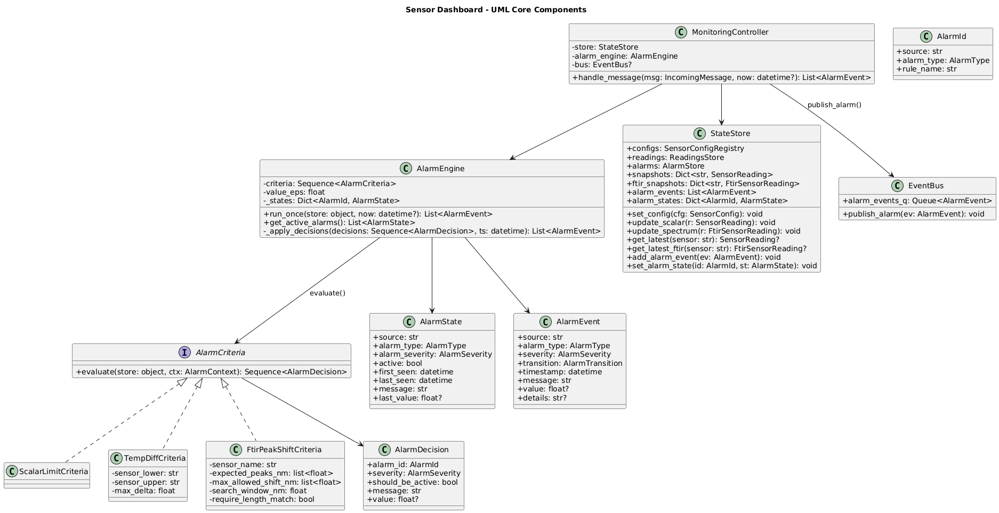

# Real-Time-Production-Line-Sensor-Dashboard-with-Remote-Access-Notifications
Python desktop application designed for a production line environment. The system must monitor at least 5 sensors simultaneously, update data in real time, trigger alarms when limits are exceeded, provide remote data access, and include optional advanced maintenance &amp; notification features.

A production-ready, event-driven monitoring system for real-time sensor ingestion, alarm evaluation, visualization, and notification delivery.
This project is designed to demonstrate clean architecture, thread-safe design, configuration-driven behavior, and industrial-style alarm lifecycle management.

---

## Table of Contents

- Running the application
- Overview
- System Architecture
- Runtime Flow
- Features
- APIs
- Configuration
- Communication Protocol
- Alarm Model
- Notifications 
- Simulator
- Webhook server
- Testing Strategy
- Setup Instructions
- Documentation

---

## Running the application

### Run Sensor Dashboard

#### Config:
Adjust system paramters form config.yaml before running if needed

#### Then:
.\Source_Code\dist\Sensor_Dashboard.exe

---

### Run Sensor Dashboard

.\Source_Code\dist\Simulator.exe

---

### Run Sensor Dashboard

.\Source_Code\dist\Webhook_Server.exe

---

## Overview

The Sensor Dashboard system ingests real-time sensor data over TCP, evaluates alarm
conditions using configurable rules, maintains alarm lifecycle state, visualizes
data in a GUI, and delivers alarm notifications via webhooks.

The system is fully configurable via YAML, allowing operational changes without
rebuilding the application binary.

---

## System Architecture

The system follows a layered architecture:

- Transport Layer: TCP + NDJSON ingestion
- Core Layer: Alarm engine, criteria, state management
- Runtime Layer: Thread orchestration and event flow
- Notification Layer: Webhook delivery
- UI Layer: PySide6 dashboard


---

## UML – Core Components

This diagram shows the core domain objects and their relationships.

- AlarmEngine
- AlarmCriteria
- AlarmState / AlarmEvent
- StateStore
- Runtime threads


---

## Runtime Sequence

End-to-end flow from sensor data reception to notification delivery.

1. Simulator sends NDJSON over TCP
2. ReadingsReceiverThread decodes messages
3. AlarmWorkerThread evaluates alarms
4. AlarmEngine updates state and emits events
5. EventBus distributes events
6. NotificationAdapterThread builds payloads
7. NotificationWorkerThread sends webhooks


---

## Features

- Real-time TCP (NDJSON) sensor ingestion
- Configurable scalar and spectral alarms
- Alarm lifecycle management (RAISED / UPDATED / CLEARED)
- Thread-safe shared state
- Event-driven notifications
- YAML-based configuration
- GUI dashboard
- Windows EXE packaging
- Stress-tested concurrency

---

## APIs

The following diagram shows the system API deployment:



---

## Configuration

All runtime configuration is defined in `config.yaml`.

No recompilation is required to change:
- Sensor limits
- Alarm thresholds
- TCP host/port
- Webhook endpoint
- Alarm enable/disable flags

Example:

```yaml
transport:
  tcp_client:
    host: "127.0.0.1"
    port: 9009
    timeout_s: 5.0

sensors:
  scalar_configs:
    - name: "Pressure"
      units: "bar"
      low_limit: 1.0
      high_limit: 2.0

alarms:
  value_eps: 1.0
  enable_scalar_limits: true 
```

---

## Communication Protocol

The system communicates with external data sources (simulator or real devices)
using a TCP-based streaming protocol with NDJSON (Newline Delimited JSON).

Each message is a single JSON object terminated by a newline character (`\n`).

---

### TCP Transport

- Protocol: TCP
- Encoding: UTF-8
- Message format: NDJSON
- Direction: Unidirectional (sensor → application)

The TCP connection is maintained continuously. If the connection drops,
the receiver thread automatically attempts to reconnect.

---

### Message Types

#### Scalar Sensor Reading

Represents a single numeric measurement (e.g., temperature, pressure).

```json
{
  "type": "sensor_reading",
  "sensor": "Pressure",
  "value": 1.8,
  "timestamp": "2026-01-01T12:00:00"
}
```
##### Fields:

- type: Message discriminator (sensor_reading)
- sensor: Sensor channel name
- value: Numeric measurement
- timestamp: ISO-8601 timestamp

--

#### FTIR Spectrum Reading

Represents a fixed-length spectral measurement.

```json
{
  "type": "ftir_spectrum",
  "sensor": "FTNIR",
  "values": [0.12, 0.15, 0.11, ...],
  "timestamp": "2026-01-01T12:00:01"
}
```

##### Fields:

- type: Message discriminator (ftir_spectrum)
- sensor: Sensor channel name
- values: Spectrum array
- timestamp: ISO-8601 timestamp


---

## Alarm Model

The alarm system is designed using a strict separation between
**stateless evaluation** and **stateful lifecycle management**.

This design prevents hidden coupling, simplifies testing, and allows
multiple alarm rules to coexist safely.

---

### AlarmCriteria

Alarm criteria are **stateless rule evaluators**.

Responsibilities:
- Inspect the latest available sensor readings
- Apply a single alarm rule
- Produce `AlarmDecision` objects
- Do not store history or state

Each criterion operates independently.

Implemented criteria include:
- `ScalarLimitCriteria`
- `TempDiffCriteria`
- `FtirPeakShiftCriteria`

---

### AlarmEngine

The `AlarmEngine` is a **stateful lifecycle manager**.

Responsibilities:
- Track alarm states across evaluations
- Convert decisions into lifecycle transitions
- Emit `AlarmEvent` objects
- Suppress noisy updates using configurable tolerance

Supported transitions:
- `RAISED` (inactive → active)
- `UPDATED` (active → active, meaningful change)
- `CLEARED` (active → inactive)
As shown below:


---

### AlarmState

`AlarmState` represents the **current condition** of an alarm.

Stored information:
- Alarm source
- Alarm type
- Severity
- Active flag
- First time seen
- Last time seen
- Latest message
- Latest numeric value (optional)

Alarm states are optimized for:
- UI queries
- Reporting
- Snapshot-based notifications

---

### AlarmEvent

`AlarmEvent` represents a **discrete lifecycle transition**.

Events are emitted only when:
- An alarm becomes active
- An alarm clears
- An active alarm meaningfully changes

Events are immutable and suitable for:
- Logging
- Auditing
- Notification delivery

---

## Notifications

The notification system is **fully decoupled** from alarm evaluation.

Alarm generation never blocks on notification delivery.

---

### Notification Flow

1. `AlarmEngine` emits an `AlarmEvent`
2. `EventBus` publishes the event
3. `NotificationAdapterThread` subscribes
4. A snapshot payload is built from `StateStore`
5. `NotificationWorkerThread` delivers the message asynchronously

---

### Webhook Notifications

- Protocol: HTTP POST
- Payload: JSON
- Authentication: Optional Authorization header
- Delivery: Best-effort (non-blocking)

Example payload:

```json
{
  "type": "alarm_event",
  "event": {
    "source": "Pressure",
    "alarm_type": "HIGH_LIMIT",
    "severity": "WARNING",
    "transition": "RAISED",
    "timestamp": "2026-01-01T12:00:05",
    "message": "Pressure HIGH: 2.3 > 2.0 bar",
    "value": 2.3,
    "details": "rule=config_high_limit"
  },
  "totals": {
    "alarm_states_total": 3,
    "alarm_states_active": 1,
    "alarm_events_total": 12
  }
}
```

---

## Threading Model

The application uses a multi-threaded architecture to ensure responsiveness,
fault isolation, and scalability.

Each thread has a single responsibility and communicates with other threads
exclusively through thread-safe queues.

---

### Threads Overview
The following diagram shows the threading model:


- **ReadingsReceiverThread**
  - Owns the TCP connection
  - Receives and decodes NDJSON messages
  - Automatically reconnects on failure
  - Pushes decoded messages into the readings queue

- **AlarmWorkerThread**
  - Consumes decoded readings
  - Updates the shared StateStore
  - Executes alarm evaluation logic
  - Publishes AlarmEvent objects to the EventBus

- **NotificationAdapterThread**
  - Subscribes to AlarmEvent objects
  - Builds notification payloads using StateStore snapshots
  - Emits NotificationEvent objects asynchronously

- **NotificationWorkerThread**
  - Sends notifications to external systems
  - Handles retries and failures without blocking core logic

- **UI Thread**
  - Renders the dashboard
  - Reads snapshots from StateStore
  - Never performs blocking I/O

---

### Thread Safety Guarantees

- All shared state is accessed via `StateStore`
- `StateStore` uses a re-entrant lock (`RLock`)
- Queues isolate producers and consumers
- Overflow is handled gracefully by dropping newest messages

Queues are used between threads to:
- Avoid blocking
- Prevent cascading failures
- Apply backpressure under load

This design prevents:
- Race conditions
- Deadlocks
- UI freezes
- Cascading failures

---

## Simulator

### Overview

The Simulator emulates a real sensor acquisition system and acts as the data source for the Sensor Dashboard application. It produces realistic sensor readings and streams them over a TCP connection using the NDJSON (Newline-Delimited JSON) format.


---

### The simulator enables:

- Lower MSP Temperature Sensor
- Upper MSP Temperature Sensor
- Vibration Sensor
- Pressure Sensor
- FT-IR sensor
- Enviroment senarios (Temp chamber & shaking modes)
- Stress and fault-injection scenarios


---

### Responsibilities

The simulator is responsible for:

- Generating synthetic sensor readings
- Emulating multiple sensor types (scalar + FTIR)
- Injecting abnormal conditions (spikes, noise, drift)
- Streaming data continuously over TCP
- Remaining fully decoupled from application logic

### Data Transport

- Protocol: TCP
- Encoding: NDJSON
- Default Port: 9009
- Each message is sent as a single JSON object followed by a newline.

Example NDJSON message:

```json
{"type":"sensor_reading","sensor":"Pressure","value":2.31,"timestamp":"2026-01-01T18:44:55","status":"OK"}
```

---

### Design Principles

- Stateless message generation
- No alarm or business logic
- Deterministic + random hybrid modeling
- Safe to run continuously in development environments

---

## Webhook Server

### Overview

The Webhook Server is an external HTTP service responsible for receiving alarm notifications emitted by the Sensor Dashboard application.
It acts as an integration point for downstream systems such as monitoring dashboards, incident management tools, SOC systems, or logging pipelines.

In the reference implementation, the webhook server is built using Flask and exposes a REST endpoint that accepts structured alarm payloads.

---

### Responsibilities

The webhook server is responsible for:

- Receiving alarm notifications via HTTP POST
- Validating incoming payloads
- Logging or persisting alarm events
- Enabling integration with third-party systems (SIEM, ticketing, alerting, etc.)
- Acting as a decoupled consumer of the app’s alarm domain events

### Communication Protocol

- Protocol: HTTP / HTTPS
- Method: POST
- Content-Type: application/json
- Authentication: Authorization header (Bearer token)

---

### Endpoint:

POST /alarm

### Payload Structure

```json
{
  "type": "alarm_event",
  "event": {
    "source": "Pressure",
    "alarm_type": "HIGH_LIMIT",
    "severity": "WARNING",
    "transition": "RAISED",
    "timestamp": "2026-01-01T18:45:10",
    "message": "Pressure HIGH: 2.34 > 2.00 bar",
    "value": 2.34,
    "details": "rule=config_high_limit"
  },
  "totals": {
    "alarm_states_total": 4,
    "alarm_states_active": 1,
    "alarm_events_total": 17,
    "state_counts_by_severity": {
      "WARNING": 1
    },
    "event_counts_by_transition": {
      "RAISED": 10,
      "CLEARED": 7
    }
  }
}
```

---

### Security Considerations

TLS can be enabled/disabled via configuration (verify_tls)
Authentication is handled using a static Bearer token
The webhook server is intentionally stateless and idempotent-friendly

---

## Testing Strategy

The project follows a layered testing approach to ensure correctness,
robustness, and production readiness.

---

### Unit Tests

Unit tests validate individual components in isolation.

Covered areas:
- AlarmEngine lifecycle transitions
- AlarmCriteria rule correctness
- StateStore data consistency
- Transport NDJSON decoding
- Notification payload construction

Unit tests are deterministic and fast.

---

### Stress and Concurrency Tests

Stress tests validate:

- Multi-threaded EventBus publishing
- StateStore race-condition resistance
- Queue overflow handling
- Long-running thread stability

---

## Setup Instructions

### Prerequisites

- Python 3.12+
- Windows 10/11 (for EXE build)
- Virtual environment recommended

---

### Environment Setup:

Create and activate a virtual environment:

```bash 
python -m venv .venv
source .venv/bin/activate   # Linux / macOS
.venv\Scripts\activate      # Windows
```

---

### Install dependencies:

```bash
pip install -r requirements.txt
```
---

## Documentation

- README.md – System overview and usage
- DEPLOYMENT.md – Production deployment guide
- UML_Diagrams\ – Architecture and UML diagrams
- .\Source_Code\dist\config.yaml – Runtime configuration reference
